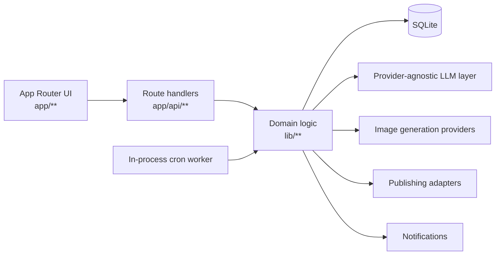
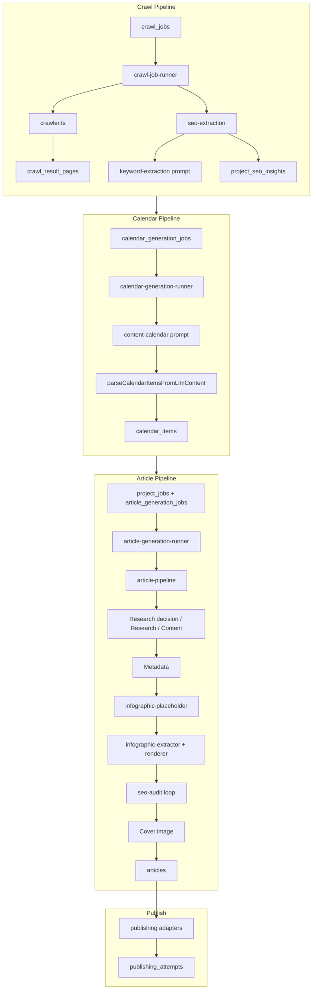
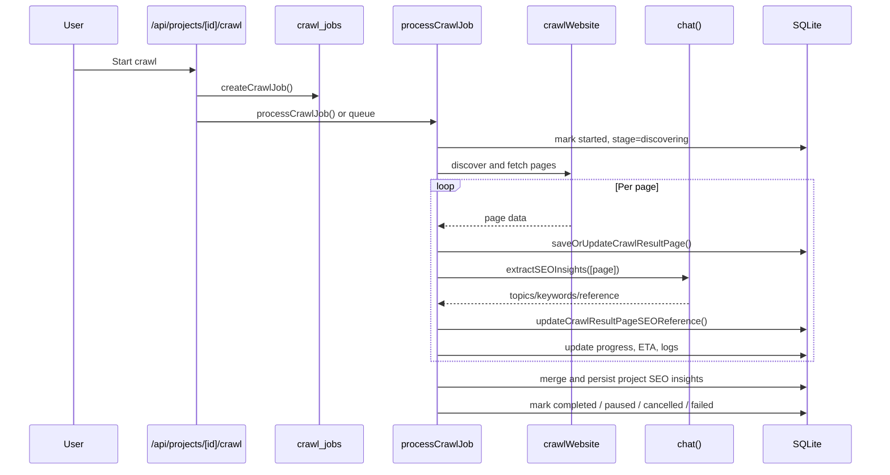
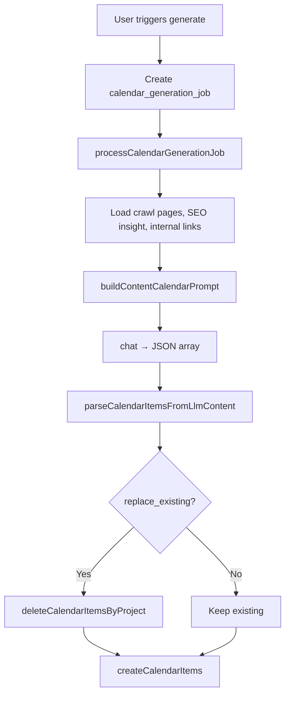
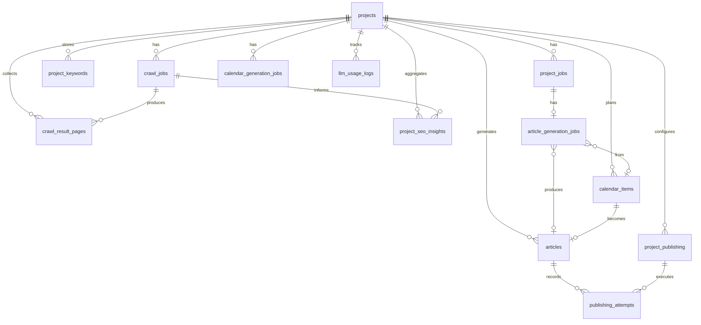

# Better Articles

`better_articles` is a project-scoped SEO content operations app built with Next.js and SQLite.

It does more than "crawl and write":

1. **Crawl** a site with pause, resume, and cancel support.
2. **Extract** AI-powered SEO research signals from each crawled page.
3. **Persist** deduplicated research as reusable project context.
4. **Plan** a structured content calendar tied to real site URLs.
5. **Generate** articles through research decision → research (optional) → content → metadata.
6. **Enrich** with infographic placeholders (auto-rendered to images), cover images, and SEO optimization.
7. **Publish** to one or more CMS destinations and record publishing history.

## What The App Optimizes For

- Better site research, not just raw crawling.
- Cost-aware AI usage with token logging and structured prompt compression.
- Durable project memory through SQLite-backed crawl, SEO, article, and publish records.
- A full article asset pipeline, not text-only generation.
- Automation that still gives operators control over crawl and publish behavior.

## Core Capabilities

- Project-based workspaces.
- Automatic site crawl with sitemap-first discovery.
- First crawl capped at `50` pages by default for lower cost and faster onboarding.
- AI-per-page SEO extraction during crawl.
- Project-level SEO insights with keywords, topics, entities, questions, pain points, search intents, and content angles.
- AI-generated content calendar tied to existing site URLs.
- Article generation pipeline with research decision, optional research brief, full draft, metadata, infographic placeholders (auto-rendered to images), SEO optimization loop, and optional cover image generation.
- Global text-generation provider settings.
- Global image-generation provider settings for article thumbnails.
- Global structured prompt mode toggle: `TOON` or compact `JSON`.
- Project-level publishing configuration for WordPress, Ghost, Medium, Wix, Odoo, and generic webhooks.
- Auto-publish support plus publish attempt logging.
- Token usage tracking per project.
- In-process cron worker for background crawl and scheduled article generation.

## Stack

| Layer | Technology |
|---|---|
| Web app | Next.js App Router, React 19 |
| UI | Tailwind CSS, Radix UI, Lucide |
| Database | SQLite via `better-sqlite3` |
| Parsing/crawl | `cheerio`, custom crawl runner |
| Markdown rendering | `marked` |
| Prompt compression | `@toon-format/toon`, `gpt-tokenizer` |
| Publishing | Custom adapters per platform |
| Notifications | Nodemailer |

## Quick Start

1. Install dependencies:

```bash
npm install
```

2. Start the app:

```bash
npm run dev
```

3. Open the app and configure at least one LLM in `App settings -> LLM Provider`.
4. Optionally configure article image generation in `App settings -> Article Images`.
5. Optionally choose `TOON` or `JSON` in `App settings -> Global -> Prompt optimizations`.
6. Create a project and provide a homepage URL.
7. Let the app run the initial crawl, then move to calendar planning and article generation.

## Runtime And Persistence

- The database defaults to `./data/app.db`.
- Override the database path with `DATABASE_PATH`.
- The app uses an in-process cron worker started from `instrumentation.ts`.
- This means background automation works without an external scheduler as long as the Node process is running.
- SQLite requires persistent writable storage in production.

## Environment Variables

Only a small set of runtime variables are expected outside the UI:

| Variable | Purpose |
|---|---|
| `DATABASE_PATH` | Override the default SQLite file location |
| `CRON_SECRET` | Optional secret for `GET /api/cron/process-jobs?key=...` |

LLM keys, image keys, notification settings, and prompt mode are configured in the app UI and persisted to the database.

## Configuration Model

### App-Level Settings

Configured in `app/settings/page.tsx` and persisted through `app_settings`, `llm_settings`, and related settings helpers:

- Default text LLM provider, model, key, and base URL.
- Enable thinking / reasoning mode (for models that support it, e.g. o1, o3, Claude, Qwen). Increases quality but uses more tokens.
- Default image generation provider, model, key, size, quality, and style prompt.
- Notification email and SMTP settings.
- Global structured prompt mode:
  - `TOON`
  - `JSON`

### Project-Level Settings

Configured under each project:

- Site connection data.
- Crawl behavior.
- Article defaults.
- Publishing destinations.
- Scheduling and auto-publish behavior.

## End-To-End System Diagram

```mermaid
flowchart TD
    subgraph CRAWL["Crawl Pipeline"]
        A[Project created] --> B[Initial crawl job]
        B --> C[URL discovery<br/>sitemap first, then homepage links]
        C --> D[Fetch page]
        D --> E[Save crawl_result_pages]
        E --> F[AI SEO extraction per page]
        F --> G[Store page-level SEO reference]
        G --> H{More pages?}
        H -->|Yes| D
        H -->|No| I[Merge and deduplicate SEO insights]
        I --> J[Persist project_keywords + project_seo_insights]
    end

    subgraph PLAN["Planning Pipeline"]
        J --> K[Calendar generation job]
        K --> L[buildContentCalendarPrompt]
        L --> M[LLM → JSON array]
        M --> N[Parse + validate calendar_items]
        N --> O[Save calendar_items]
    end

    subgraph ARTICLE["Article Generation Pipeline"]
        O --> P[Article generation job]
        P --> Q[Research decision]
        Q --> R{needsResearch?}
        R -->|Yes| S[Research prompt → research_content]
        R -->|No| T[Skip research]
        S --> U[Content prompt]
        T --> U
        U --> V[Stream article markdown]
        V --> W[Infographic placeholders<br/>[Infographic: Title]]
        W --> X[Metadata prompt → JSON]
        X --> Y[generateAndReplacePlaceholders<br/>→ infographic images]
        Y --> Z[SEO optimization loop<br/>until score ≥ 90]
        Z --> AA[Optional cover image]
        AA --> AB[Persist article]
    end

    subgraph PUBLISH["Publishing"]
        AB --> AC[Publish to enabled destinations]
        AC --> AD[Record publishing_attempts]
        AD --> AE[Update published_url]
    end
```

## High-Level Architecture



## Pipeline Architecture Overview



## Main Architectural Building Blocks

### 1. UI Layer

The user-facing application lives in `app/**` and `components/**`.

Important pages:

- `app/page.tsx`
- `app/settings/page.tsx`
- `app/projects/[id]/page.tsx`
- `app/projects/[id]/crawl/page.tsx`
- `app/projects/[id]/crawl/[jobId]/page.tsx`
- `app/projects/[id]/calendar/page.tsx`
- `app/projects/[id]/write/[calendarItemId]/page.tsx`
- `app/projects/[id]/articles/[articleId]/page.tsx`
- `app/projects/[id]/content-history/page.tsx`
- `app/projects/[id]/settings/**`

### 2. API Layer

Route handlers live in `app/api/**`.

Important handlers:

- `app/api/projects/[id]/route.ts`
- `app/api/projects/[id]/crawl/route.ts`
- `app/api/projects/[id]/crawl/[jobId]/route.ts`
- `app/api/projects/[id]/crawl/[jobId]/stream/route.ts`
- `app/api/projects/[id]/calendar/route.ts`
- `app/api/article/route.ts`
- `app/api/projects/[id]/publish/route.ts`
- `app/api/cron/process-jobs/route.ts`
- `app/api/settings/**`

### 3. Domain Logic Layer

Most business logic lives in `lib/**`.

Important modules:

- Crawl: `lib/crawler.ts`, `lib/crawl-job-runner.ts`
- SEO extraction: `lib/seo-extraction.ts`
- Prompt builders: `lib/prompts/**` (see `prompts.md` for full documentation)
- Article generation: `lib/article-generation-runner.ts`, `lib/article-pipeline.ts`, `lib/article-assets.ts`
- Infographics: `lib/infographic-placeholder.ts`, `lib/infographic-extractor.ts`, `lib/infographic-renderer.ts`, `lib/infographic-regeneration.ts`
- SEO audit: `lib/seo-audit.ts`, `lib/seo-rules.ts`
- Calendar: `lib/calendar-generation-runner.ts`, `lib/calendar-generation-parser.ts`
- LLM client: `lib/llm.ts`
- Image generation: `lib/image-generation.ts`
- Publishing: `lib/publishing/**`
- Cron: `lib/cron-worker.ts`
- Notifications: `lib/notifications.ts`
- DB access: `lib/db/**`

### 4. Persistence Layer

SQLite schema is defined in `lib/db/schema.ts`, with additive migrations in `lib/db/migrate.ts`.

## Crawl Pipeline

The crawl pipeline is not just URL collection. It is a staged acquisition pipeline that combines fetch, persistence, AI analysis, deduplication, and resumable job control.

Primary files:

- `app/api/projects/[id]/crawl/route.ts`
- `app/api/projects/[id]/crawl/[jobId]/route.ts`
- `app/api/projects/[id]/crawl/[jobId]/stream/route.ts`
- `lib/crawl-job-runner.ts`
- `lib/crawler.ts`
- `lib/db/crawl-jobs.ts`

### Crawl Behavior

- A crawl job is created in `crawl_jobs`.
- Initial crawl defaults to `max_pages = 50`.
- The system requires at least one configured text LLM before crawling.
- Sitemap discovery is preferred when available.
- If no sitemap is available, the crawler falls back to homepage and internal links.
- Each page is persisted before deeper AI processing.
- AI SEO extraction is performed page-by-page during the crawl, not only after the crawl.
- Partial AI research is preserved if the job is paused or cancelled.

### Crawl Diagram



### Crawl Control States

The job runner supports:

- `pending`
- `running`
- `paused`
- `cancelled`
- `completed`
- `failed`

The control checks are enforced inside `lib/crawl-job-runner.ts` through `getControlState()` and `assertJobCanContinue()`.

### Crawl Outputs

Each crawl can produce:

- URL and metadata rows in `crawl_result_pages`
- crawl logs in `crawl_job_logs`
- project keywords in `project_keywords`
- aggregated SEO insight in `project_seo_insights`
- per-page SEO reference JSON on crawl result rows

## SEO Extraction Pipeline

Primary files:

- `lib/seo-extraction.ts`
- `lib/prompts/keyword-extraction.ts`
- `app/api/projects/[id]/extract-keywords/route.ts`

### What The Extractor Pulls Out

- Topics
- Keywords
- Entities
- Questions
- Pain points
- Content angles
- Search intents
- Products/services
- Summary

### Important Implementation Details

- Pages are processed in batches for project-level extraction.
- During crawl, single-page extraction is run immediately after each page is fetched.
- The extractor waits between batches to reduce provider pressure.
- The extractor honors pause and cancel signals.
- The app saves partial extraction results when an in-progress crawl is paused or cancelled.

## Prompts Reference

All AI prompts are documented in **`prompts.md`**. Summary:

| Prompt | Location | Used by |
|--------|----------|---------|
| Research decision | `lib/article-pipeline.ts` (inline) | Article pipeline |
| Research | `lib/prompts/research.ts` | Article pipeline |
| Content | `lib/prompts/content.ts` | Article pipeline |
| Metadata | `lib/prompts/metadata.ts` | Article pipeline |
| Content calendar | `lib/prompts/content-calendar.ts` | Calendar runner |
| Keyword extraction | `lib/prompts/keyword-extraction.ts` | SEO extraction |
| Infographic regeneration | `lib/infographic-regeneration.ts` | Regenerate infographic API |
| Article defaults inference | `lib/article-default-inference.ts` | Load optimal defaults |
| Fact check, Humanize, SEO (full) | `lib/prompts/fact-check.ts`, `humanize.ts`, `seo.ts` | `buildAllPrompts()` |

The shared **SEO rules block** (`lib/seo-rules.ts` → `SEO_RULES_PROMPT_BLOCK`) is injected into Research, Content, and Metadata prompts. Target score: 90; prompt copy uses "91+".

## Structured Prompt Mode: TOON vs JSON

Primary files:

- `lib/prompts/toon.ts`
- `lib/db/settings.ts`
- `app/api/settings/prompt-optimizations/route.ts`
- `app/settings/page.tsx`

### What It Does

The app can serialize structured prompt context in two formats:

- `TOON` for compact token-aware structured data
- `JSON` for compatibility or operator preference

This is a global setting and affects major structured prompt paths, including:

- SEO extraction prompts
- content calendar prompts
- article generation prompts
- metadata prompts

### Why It Exists

- Reduce prompt token usage on list-heavy context.
- Keep structured prompt inputs more consistent.
- Let operators switch back to JSON if they want a more familiar format or need troubleshooting.

### Prompt Mode Diagram

```mermaid
flowchart LR
    A[Structured context object] --> B{Global mode}
    B -->|TOON| C[serializeStructuredPromptBlock -> TOON]
    B -->|JSON| D[serializeStructuredPromptBlock -> compact JSON]
    C --> E[Prompt builder]
    D --> E
    E --> F[chat() system prompt includes format awareness]
```

## Content Calendar Pipeline

Primary files:

- `app/api/projects/[id]/calendar/route.ts`
- `lib/calendar-generation-runner.ts`
- `lib/calendar-generation-parser.ts`
- `lib/prompts/content-calendar.ts`
- `lib/db/calendar.ts`
- `lib/db/calendar-generation-jobs.ts`
- `app/projects/[id]/calendar/page.tsx`

### Job Architecture

Calendar generation uses a dedicated job table:

```
calendar_generation_jobs
    ├── id, project_id, status, progress
    ├── replace_existing, append_existing, whole_month
    ├── suggestion_count, start_date, end_date, feedback
    └── calendar_generation_job_logs
```

### Calendar Generation Flow



### Inputs To The Calendar Model

- Latest crawl pages, or manual URLs if no crawl exists
- Extracted project keywords
- Latest project SEO insight (summary, topics, questions, pain points, content angles)
- User-provided internal links (ONLY these for `internalLinkTargets`)
- Existing calendar items when appending or regenerating (avoid duplicates)
- Published articles (avoid near-duplicates)
- User feedback for regeneration flows
- Domain knowledge, content idea custom instructions

### Output Shape

Each suggestion includes:

- `title`, `primaryKeyword`, `secondaryKeywords`
- `suggestedDate`
- `contentGapRationale`
- `internalLinkTargets` (ONLY from user-provided internal links)
- `infographicConcepts` (exactly 1 per article when infographics enabled)
- `rankingPotential`, `rankingJustification`

**Critical:** `internalLinkTargets` may only use URLs from the user-provided internal links list. Crawled pages are context only.

### Calendar Design Principle

Every article idea should complement a real page on the site. The calendar is not generic topic generation; it is site-aware planning.

## Article Generation Pipeline

Primary files:

- `app/api/projects/[id]/article-jobs/route.ts` – Create article generation job
- `app/api/projects/[id]/article-jobs/[jobId]/stream/route.ts` – SSE stream for live progress
- `lib/article-generation-runner.ts` – Main orchestration (`processArticleGenerationJob`)
- `lib/article-pipeline.ts` – Research decision, content generation, SEO patches
- `lib/prompts/research.ts`, `lib/prompts/content.ts`, `lib/prompts/metadata.ts`
- `lib/article-assets.ts` – Metadata generation, bootstrap, H1 sync
- `lib/infographic-placeholder.ts` – Placeholder → image replacement
- `lib/image-generation.ts` – Cover image generation

### Job Architecture

Article generation uses a **project job** model:

```
project_jobs (job_type: 'article_generation')
    └── article_generation_jobs (1:1)
            ├── input_json (ArticlePipelineInput)
            ├── research_content
            ├── content
            ├── metadata_json
            └── article_id
```

Jobs are created from the calendar write page or article detail page. The cron worker or manual trigger runs `processArticleGenerationJob(projectJobId)`.

### Pipeline Stages (in order)

| Stage | Request label | Description |
|-------|---------------|-------------|
| 1 | `article-research-decision` | LLM decides if research brief needed (or heuristic skip) |
| 2 | `article-research` | Optional: build research brief when `needsResearch: true` |
| 3 | `article-content` | Main content prompt → stream markdown with `[Infographic: Title]` placeholders |
| 4 | `article-content-complete` | Finish any cutoff sections |
| 5 | `article-metadata` | Generate title, slug, SEO title, meta description, tags, category, cover prompt |
| 6 | Infographic replacement | `generateAndReplacePlaceholders` → extract spec, render to base64 image, replace placeholder |
| 7 | `article-seo-optimize` | Loop: audit → patch or regenerate metadata until score ≥ 90 |
| 8 | Cover image | Optional: text-to-image for `coverImagePrompt` |
| 9 | Persist | Upsert to `articles`, update `calendar_items` status |

### Article Pipeline Diagram

```mermaid
flowchart TD
    A[calendar_item + project defaults] --> B[Research decision]
    B --> C{needsResearch?}
    C -->|Yes| D[Research prompt]
    C -->|No| E[Skip]
    D --> F[research_content]
    E --> G[Content prompt]
    F --> G
    G --> H[Stream article markdown<br/>with placeholders]
    H --> I[Metadata prompt]
    I --> J[title, slug, seoTitle, metaDescription, tags, category]
    J --> K[generateAndReplacePlaceholders]
    K --> L[Extract → Render → Replace<br/>[Infographic: X] → base64 image]
    L --> M[SEO audit]
    M --> N{score ≥ 90?}
    N -->|No| O[Patch or regenerate metadata]
    O --> M
    N -->|Yes| P{Auto images?}
    P -->|Yes| Q[Cover image generation]
    P -->|No| R[Persist article]
    Q --> R
    R --> S[Publish to destinations]
```

### Article Record Fields

The `articles` table stores:

- `research_content` – Markdown research brief (when used)
- `content` – Final article markdown (with infographic blocks as `data:image/png;base64` or HTML)
- `status` – draft, published, etc.
- `language`, `title`, `slug`, `seo_title`, `meta_description`, `excerpt`, `tags_json`, `category`
- `cover_image_base64`, `cover_image_mime_type`, `cover_image_prompt`, `cover_image_alt`
- `publish_metadata_json`, `published_url`, `last_published_at`

### Article Structure and Lead Sections

Article structure is conditional on **article type** and **length** (Short, Medium, Long, Ultra-long). The content prompt in `lib/prompts/content.ts` controls this.

#### Key Takeaways

- **Included when:** Article type is *not* news, opinion, editorial, story, profile, or interview, **and** length is Long or Ultra-long.
- **Skipped when:** Short or Medium length, or article type is news/opinion/editorial/story/profile/interview.

#### Table of Contents

- **Included when:** Article type is *not* news, opinion, editorial, story, profile, or interview, **and** length is Long or Ultra-long.
- **Also included when:** Article type is guide, how-to, tutorial, comparison, explainer, report, research, analysis, or case-study (even for Medium length).
- **Skipped when:** Short or Medium length with non-guide types, or article type is news/opinion/editorial/story/profile/interview.

#### Heading Hierarchy

- One `# H1` at the top (title only). The title is never repeated as plain text in the intro or body.
- `## H2` for each major section.
- `### H3` for subsections.
- Body sections are organized into distinct H2s (e.g. `## Key Concepts`, `## Step-by-Step Guide`, `## Common Mistakes`).

#### When Both Are Used

- `## Key Takeaways` appears first, immediately after the introduction.
- `## Table of Contents` appears immediately after Key Takeaways (or after the intro if Key Takeaways is skipped).

| Article type | Length | Key Takeaways | Table of Contents |
|-------------|--------|---------------|-------------------|
| Guide | Long | ✅ | ✅ |
| How-to | Medium | ❌ | ✅ |
| News | Long | ❌ | ❌ |
| Listicle | Short | ❌ | ❌ |
| Comparison | Ultra-long | ✅ | ✅ |
| Interview | Long | ❌ | ❌ |

### Infographic Pipeline

Infographics use a **placeholder-first** flow:

1. **Content prompt** instructs the LLM to output `[Infographic: Clear infographic title]` placeholders (not HTML). Count by length: Short/Medium = 1, Long = 2, Ultra-long = 2–3.
2. **If placeholders missing** – `injectInfographicPlacementsFromExtractor` uses an LLM to infer placements and inject them.
3. **Replacement** – `generateAndReplacePlaceholders`:
   - Extracts context around each placeholder
   - `extractInfographicSpecFromContext` → structured `InfographicSpec` (chartType, title, data)
   - `renderInfographicToBase64` → PNG via `app/infographic/render` (Puppeteer)
   - Replaces `[Infographic: X]` with `Infographic: X\n\`\`\`data:image/png;base64\n...\`\`\``
4. **Regeneration** – User can regenerate a specific infographic via `regenerate-infographic` API; uses `buildInfographicRegenerationPrompt` for HTML output or image generation.

Primary files:

- `lib/infographic-placeholder.ts` – Placeholder detection, injection, replacement
- `lib/infographic-extractor.ts` – Extract `InfographicSpec` from context
- `lib/infographic-renderer.ts` – Render spec to base64 PNG
- `lib/infographic-regeneration.ts` – Regeneration prompt for HTML infographics
- `app/infographic/render/page.tsx` – Headless render target
- `app/api/infographic/generate/route.ts` – Infographic generation API
- `app/api/projects/[id]/articles/[articleId]/regenerate-infographic/route.ts` – Per-infographic regeneration

### SEO Optimization Loop

The pipeline runs an **SEO optimization loop** until `score ≥ 90` (or max passes):

1. **Audit** – `buildSeoAudit()` scores the article against `lib/seo-rules.ts` targets (keyword density, title length, meta description, internal links, authority links, etc.).
2. **Patch-first** – For content issues (keyword density, missing list, missing authority link, infographic keyword), `optimizeArticleForSeoSignals` attempts patch-based fixes:
   - Model returns JSON: `{ "patches": [{ "search": "unique substring", "replace": "fixed content" }] }`
   - Patches applied via search/replace. Only the first occurrence of each `search` is replaced.
3. **Metadata regeneration** – For metadata-only failures (SEO title, meta description, tags, etc.), regenerate metadata via `generateArticleMetadata`.
4. **Metadata bootstrap** – When stuck (15+ passes, no progress), `bootstrapMetadataForSeo` applies programmatic fixes (e.g. prepend keyword to title).
5. **Safety cap** – Loop stops after 500 passes or when score ≥ 90.

**Patchable content checks** – `PATCHABLE_CONTENT_CHECK_IDS` in `lib/article-pipeline.ts` defines which checks can be fixed via patches vs full rewrite.

### Cover Images

Cover images are generated by a separate text-to-image provider layer and stored directly in the article row as Base64 plus MIME type.

## Publishing Pipeline

Primary files:

- `app/api/projects/[id]/publish/route.ts`
- `lib/publishing/index.ts`
- `lib/publishing/types.ts`
- `lib/publishing/adapters/wordpress.ts`
- `lib/publishing/adapters/ghost.ts`
- `lib/publishing/adapters/medium.ts`
- `lib/publishing/adapters/wix.ts`
- `lib/publishing/adapters/odoo.ts`
- `lib/publishing/adapters/webhook.ts`

### Supported Destinations

- WordPress
- Ghost
- Medium
- Wix
- Odoo
- Webhook

### How Publishing Works

1. Read the final article row.
2. Build a normalized `PublishPayload`.
3. Select enabled project destinations.
4. Dispatch through the platform adapter registry.
5. Record every result in `publishing_attempts`.
6. Update the article with `published_url` and `last_published_at` if successful.

### Adapter Registry

The adapter registry is defined in `lib/publishing/index.ts` as `PUBLISHER_REGISTRY`.

## Background Automation

Primary files:

- `instrumentation.ts`
- `lib/cron-worker.ts`
- `app/api/cron/process-jobs/route.ts`
- `lib/db/article-schedule.ts`
- `lib/db/cron-logs.ts`

### What The Cron Worker Does

Every `60` seconds it checks for:

- **Pending crawl jobs** – `crawl_jobs` with `status = 'pending'`
- **Pending calendar generation jobs** – `calendar_generation_jobs` with `status = 'pending'`
- **Pending article generation jobs** – `project_jobs` with `job_type = 'article_generation'` and `status = 'pending'`
- **Due scheduled article generations** – `article_schedule` entries

### Why This Matters

- Crawl, calendar, and article jobs do not require an external scheduler.
- All background work runs in-process.
- Operational events are written to `cron_logs` and job-specific log tables.

## Data Model Overview

### Most Important Tables

#### Project and settings

- `projects`
- `app_settings`
- `llm_settings`
- `notification_settings`
- `project_site_settings`
- `project_article_defaults`

#### Crawl and SEO

- `crawl_jobs`
- `crawl_results`
- `crawl_result_pages`
- `crawl_job_logs`
- `project_keywords`
- `project_seo_insights`
- `project_internal_links`
- `project_external_links`
- `project_manual_urls`

#### Planning and article generation

- `calendar_items`
- `calendar_generation_jobs`
- `project_jobs`
- `article_generation_jobs`
- `articles`

#### Publishing and operations

- `project_publishing`
- `publishing_attempts`
- `llm_usage_logs`
- `cron_logs`

### Simplified Data Diagram



### Job Types

| Table | Purpose |
|-------|---------|
| `crawl_jobs` | Site crawl with pause/resume/cancel |
| `calendar_generation_jobs` | Content calendar generation |
| `project_jobs` | Generic job container (type: `article_generation`, etc.) |
| `article_generation_jobs` | Article generation (1:1 with project_jobs) |

## Important Routes And Pages

### UI Routes

| Route | Purpose |
|---|---|
| `/` | Home / workspace list |
| `/settings` | App-level configuration |
| `/projects/[id]` | Project dashboard |
| `/projects/[id]/crawl` | Crawl control and history |
| `/projects/[id]/crawl/[jobId]` | Live crawl detail page |
| `/projects/[id]/calendar` | Content planning calendar |
| `/projects/[id]/write/[calendarItemId]` | Interactive article writer |
| `/projects/[id]/articles/[articleId]` | Durable article detail page |
| `/projects/[id]/content-history` | Article history |
| `/projects/[id]/settings/*` | Project settings |

### API Routes

| Route | Purpose |
|---|---|
| `/api/projects/[id]` | Project summary, stats, SEO, publishing, token usage |
| `/api/projects/[id]/crawl` | Start crawl |
| `/api/projects/[id]/crawl/jobs` | List crawl jobs |
| `/api/projects/[id]/crawl/[jobId]` | Pause, resume, cancel, inspect crawl |
| `/api/projects/[id]/crawl/[jobId]/stream` | SSE crawl progress stream |
| `/api/projects/[id]/extract-keywords` | Manual SEO extraction |
| `/api/projects/[id]/calendar` | Generate or regenerate calendar items |
| `/api/projects/[id]/calendar/jobs/[jobId]` | Calendar job status |
| `/api/projects/[id]/calendar/jobs/[jobId]/stream` | SSE calendar generation stream |
| `/api/projects/[id]/article-jobs` | Create article generation job |
| `/api/projects/[id]/article-jobs/[jobId]` | Job status, cancel |
| `/api/projects/[id]/article-jobs/[jobId]/stream` | SSE article generation stream |
| `/api/article` | Legacy interactive article generation |
| `/api/projects/[id]/articles/[articleId]` | Get/update article |
| `/api/projects/[id]/articles/[articleId]/regenerate-infographic` | Regenerate single infographic |
| `/api/projects/[id]/articles/[articleId]/regenerate-cover-image` | Regenerate cover image |
| `/api/projects/[id]/publish` | Publish article to configured platforms |
| `/api/infographic/generate` | Generate infographic from spec |
| `/api/cron/process-jobs` | Manual cron trigger |
| `/api/settings/llm` | LLM settings |
| `/api/settings/image` | Image generation settings |
| `/api/settings/prompt-optimizations` | Global TOON/JSON mode |
| `/api/projects/[id]/article-defaults/load-optimal` | AI-inferred defaults from SEO insight |

## Contributor File Guide

If you are new to the codebase, start here:

### Crawl

- `lib/crawler.ts`
- `lib/crawl-job-runner.ts`
- `lib/db/crawl-jobs.ts`

### SEO extraction

- `lib/seo-extraction.ts`
- `lib/prompts/keyword-extraction.ts`
- `lib/db/seo-insights.ts`

### Calendar

- `app/api/projects/[id]/calendar/route.ts`
- `app/api/projects/[id]/calendar/jobs/[jobId]/stream/route.ts`
- `lib/calendar-generation-runner.ts`
- `lib/calendar-generation-parser.ts`
- `lib/prompts/content-calendar.ts`
- `lib/db/calendar-generation-jobs.ts`
- `app/projects/[id]/calendar/page.tsx`

### Article generation

- `app/api/projects/[id]/article-jobs/route.ts`
- `app/api/projects/[id]/article-jobs/[jobId]/stream/route.ts`
- `lib/article-generation-runner.ts`
- `lib/article-pipeline.ts`
- `lib/article-assets.ts`
- `lib/prompts/research.ts`
- `lib/prompts/content.ts`
- `lib/prompts/metadata.ts`
- `lib/infographic-placeholder.ts`
- `lib/infographic-extractor.ts`
- `lib/infographic-renderer.ts`
- `lib/seo-audit.ts`
- `lib/seo-rules.ts`

### Publishing

- `app/api/projects/[id]/publish/route.ts`
- `lib/publishing/index.ts`
- `lib/publishing/adapters/*`

### Settings and global behavior

- `app/settings/page.tsx`
- `lib/db/settings.ts`
- `lib/prompts/toon.ts`
- `lib/llm.ts`

## Operational Notes

- The app requires at least one configured text LLM before crawl and AI workflows are enabled.
- The first automatic crawl intentionally stays small for cost control.
- AI usage is logged per project in `llm_usage_logs`.
- The project dashboard surfaces crawl coverage, token usage, and the active structured prompt mode.
- Structured prompt mode is global, not per project.
- Publishing is per project.
- Notifications are app-global.

## Known Verification Status

At the time of writing, the project has a working feature set for crawl, planning, generation, and publishing, but the repository still contains some pre-existing lint and TypeScript issues outside the README/documented changes. The broad verification commands used were:

```bash
npm run lint
npx tsc --noEmit
```

The most notable existing blockers are currently in:

- `app/projects/[id]/calendar/page.tsx`
- `app/projects/[id]/layout.tsx`
- `components/layout/home-sidebar.tsx`
- `components/workspace-selector.tsx`
- `lib/crawler.ts`
- `lib/llm.ts`

## Suggested Operator Flow

1. Configure a text LLM in `App settings`.
2. Configure image generation if you want AI thumbnails.
3. Choose `TOON` or `JSON` prompt mode.
4. Create a project.
5. Let the initial crawl collect the first reference set.
6. Review extracted SEO topics and keywords.
7. Generate the content calendar.
8. Approve or adjust ideas.
9. Generate articles.
10. Review the article detail page.
11. Publish manually or enable auto-publish destinations.

## Documentation

| Document | Purpose |
|----------|---------|
| `README.md` | This file – architecture, pipelines, data model |
| `prompts.md` | All AI prompts, input params, output shapes, import examples |

## License / Internal Use

No explicit license file is included in this repository snapshot. Add one if you plan to distribute the project externally.
